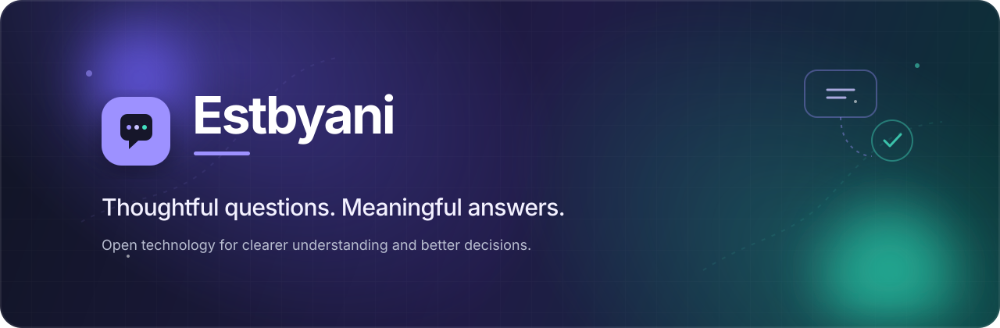

<div align="center">
  
</div>

<br />

<div align="center">

# Building better ways to understand people.

**Estbyani turns thoughtful questions into meaningful insights.**  
An AI-powered platform for surveys, forms, and feedback — built Arabic-first and fully multilingual, so teams can listen, learn, and decide with confidence.

<br />

[](https://estbyani.com)
[](https://estbyani.com)
[](mailto:info@estbyani.com)

</div>

---

## ✦ Why Estbyani?

Great decisions start with genuine understanding. Estbyani is designed to make every step—from asking the right question to acting on the answer—feel simple, clear, and human.

| | |
|---|---|
| **Arabic-first & multilingual** | Built for Arabic (RTL), English, and Simplified Chinese from day one—clear for every respondent. |
| **Insight, not just answers** | AI helps draft sharper questions and turns responses into clear, actionable decision briefs. |
| **Built for teams** | Multi-tenant workspaces with roles, invitations, live collaboration, and audit trails. |
| **Ready to scale** | Dependable foundations—Next.js, Spring Boot, and PostgreSQL—for growing audiences and ambitions. |

## ◈ What we build

Our work lives at the intersection of **feedback, research, and decision-making**.

```text
Ask with purpose  →  Listen at scale  →  Understand clearly  →  Act with confidence
```

From an intuitive form builder to a canonical, executable form specification, everything we make is engineered for clarity and trust.

## ⟡ Featured work

<!-- The product repositories are private while Estbyani is in early access. -->

| Project | Description | Links |
|:---|:---|:---:|
| **Estbyani Platform** | The multi-tenant web app and API for building surveys, collecting responses, and turning them into decisions. | [Waitlist](https://estbyani.com) |
| **EFD — Estbyani Form Definition** | A canonical, versioned, executable schema for forms: question types, logic jumps, recalls, scoring, theming, and multilingual content. | Coming soon |
| **Logic Engine** | A specified, safety-checked engine for conditional logic and branching across a form. | Coming soon |

Our repositories open to the community as the platform launches.

## ⌁ Our principles

```yaml
people_first:      Build for trust, dignity, and genuine participation.
clarity_always:    Make the complex feel calm and understandable.
craft_matters:     Sweat the details that make an experience exceptional.
learn_openly:      Share knowledge and improve through collaboration.
impact_over_noise: Focus on work that creates meaningful progress.
```

## ◎ Join the journey

Estbyani is being rebuilt with a clearer, faster experience from first question to final insight. Early access is opening soon—whether you want to try it, share feedback, or simply follow along, we would love to have you with us.

- Join the waitlist at [estbyani.com](https://estbyani.com)
- Browse our [repositories](https://github.com/orgs/estbyani/repositories)
- Get in touch at [info@estbyani.com](mailto:info@estbyani.com)

<br />

<div align="center">

### Questions deserve more than answers. They deserve understanding.

<sub>Designed and built with care by the Estbyani team.</sub>

<br /><br />

[Website](https://estbyani.com) · [Repositories](https://github.com/orgs/estbyani/repositories) · [Contact](mailto:info@estbyani.com)

</div>
